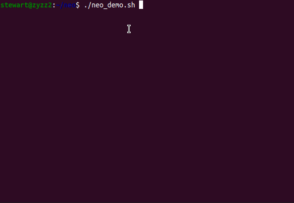
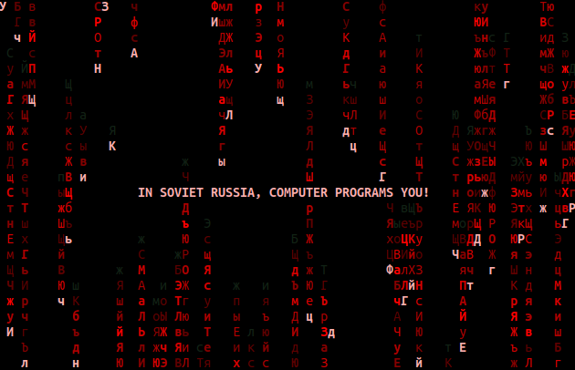
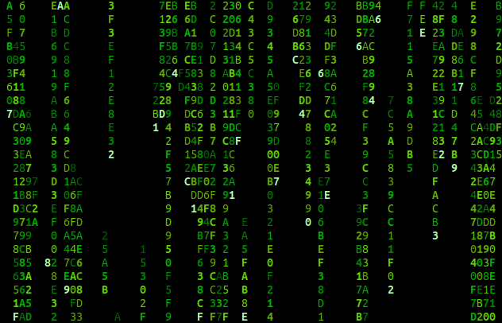
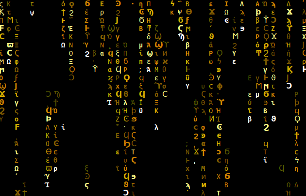

# neo



**WARNING: neo may cause discomfort and seizures in people with photosensitive epilepsy. User discretion is advised.**

**neo** recreates the digital rain effect from "The Matrix". Streams of random
characters will endlessly scroll down your terminal screen.

Cool features:

- Simulates the effect convincingly:
  - Similar color palatte and uneven colors
  - Glitchy characters
  - Half-width katakana characters
- Can display a message similar to the title crawl in the movies
- Unicode support
- Supports 16/256 colors and 32-bit color
- Automatic detection of terminal color and Unicode support
- Handles terminal resizing
- Fully customizable colors and characters
- Many key controls and command-line options for customization

**neo** is best enjoyed with some good Scotch while listening to Aphex Twin and working on tech.

## Prerequisites/Dependencies

**neo** works with Linux, and it should work with other POSIX-compliant operating systems such as macOS and FreeBSD. Windows is not supported.

The following packages are required to build and run **neo**:

- build-essential: make and g++ are used for compilation
- libncurses-dev: **neo** uses the ncursesw library to control the terminal
- autoconf: **neo** is built using autotools (NOT NEEDED if using an official release tarball)
- autoconf-archive: required for some of the autoconf checks (NOT NEEDED if using an official release tarball)

You will need to ensure that your C++ compiler supports C++11 and that your autoconf version is at least 2.61. g++ and clang++ should both work for compilation.

If you want to see Unicode characters, you must use a font that supports the characters you are trying to display. Your OS must have the font, and your terminal must use it. Your locale should have Unicode support (usually UTF-8). Check your $LANG environment variable.

A fast terminal emulator such as Alacritty is highly recommended. neo can be a bit of a CPU hog, especially on large screens with slow terminal emulators.

## Building and Installing

See [doc/INSTALL](doc/INSTALL) for more details. Make sure you have read the Prerequisites section and satisified all the requirements.

### Option 1: Using an official release tarball (EASIER)

Click on the latest release on this GitHub page. Under the Assets pane, click on neo-\<VERSION>.tar.gz and save it somewhere. Ignore the other "Source code" files.

Open a terminal and navigate to wherever you saved the tarball. Run the following commands:

```Shell
tar xzf neo-<VERSION>.tar.gz
cd neo-<VERSION>
./configure
make
sudo make install
```

### Option 2: Building from this repo

Clone this repository, open a terminal, and navigate to the repo directory.

Run the following commands:

```Shell
./autogen.sh
./configure
make -j3
sudo make install
```

### Option 3: Install from AUR (unofficial)

For Arch and its derivatives

```Shell
yay -S neo-matrix-git
```

## Uninstalling

To uninstall **neo**, run the following command from the directory where you built neo:

```Shell
sudo make uninstall
```

**neo** can also be manually uninstalled by simply deleting the installed neo executable and neo.6 man page.

## Running

Once **neo** is installed, simply run:

```Shell
neo
```

**neo** has many options and key controls, arguably *too* many, and definitely too many to list here. Check the help message and manual for more info:

```Shell
neo -h
man neo
```

## Screenshots







## FAQ/Troubleshooting

###
**Q:** **neo** displays garbage characters on the screen. How can this be fixed?

**A:** **neo** will attempt to use half-width katakana characters by default. You may not have a font installed that can display them correctly, or your terminal might not support Unicode well. Try "--charset=ascii" or changing your font. You may also need to use the "--colormode=0" option to disable color.

###
**Q:** Colors aren't working. How can this be fixed?

**A:** Make sure your terminal supports colors. Double check if you need to set the TERM environment variable to enable colors. You may want to try the "--colormode" option.

###
**Q:** How do I disable the blinking characters?

**A:** Use the --noglitch option.

###
**Q:** Can I make the text scroll faster or slower?

**A:** Yes, use the -S/--speed option. Also, the UP and DOWN keys change the speed. The --async option may be fun to try.

###
**Q:** How do I change the colors?

**A:** Use the -c/--color option (e.g. "-c red"). The number keys also change the color while running. Check out the "COLOR FILE" section in the manual if you want to customize **neo** with your own colors.

###
**Q:** How do I change the characters displayed?

**A:** Use the --charset and/or --chars option. You may also need to use the -F/--fullwidth option depending on the characters you selected.

###
**Q:** How do I display a message in the center of the screen?

**A:** Use the -m/--message option. Don't forget to use double quotes!

###
**Q:** neo just shows simple ASCII characters. How can I make it show Unicode characters?

**A:** neo detects if your locale supports Unicode. Typically, your $LANG environment variable should have "UTF" somewhere if it does (e.g. "en_US.UTF-8"). You can use commands such as localectl to change these settings. You can force **neo** to attempt to use Unicode by setting a custom charset (e.g. --charset=extended), but this still may not work due to other OS and terminal settings.

## Bugs

File a GitHub issue. Crashes and build failures will be prioritized. Minor bugs, documentation errors, etc should hopefully get triaged and fixed... eventually.

## Contributing

See [doc/HACKING](doc/HACKING) for more implementation details and a list of things that could be improved.

Requests for enhancement (RFEs) are not likely to be considered or implemented unless they are:

- Within the scope of the original application
- Simple
- Likely to be used by more than one person

The original author deliberately avoided some features present in similar projects (e.g. custom fonts and Windows support) for simplicity.

Pull requests will be handled in a similar manner. Pull requests for bug fixes are more likely to be accepted than new features.

## Acknowledgments

- Chris Allegretta, the original author of cmatrix, and Abishek V Ashok, its current maintainer. cmatrix was a source of inspiration for **neo**.
- Thomas E. Dickey, because **neo** would have been a PITA to write without ncursesw
- Everyone involved in the production of "The Matrix" and the rest of the franchise

## License

**neo** is provided under the GNU GPL v3. See [doc/COPYING](doc/COPYING) for more details.

## Disclaimer

This project is not affiliated with "The Matrix", Warner Bros. Entertainment Inc., Village Roadshow Pictures, Silver Pictures, nor any of their parent companies, subsidiaries, partners, or affiliates.
